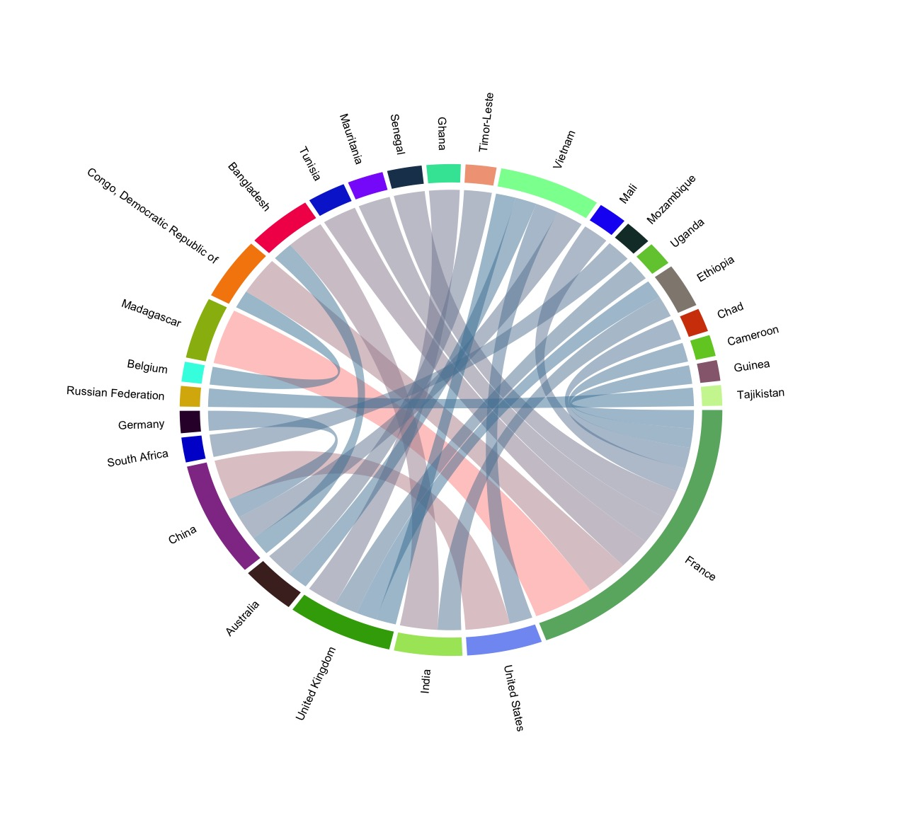
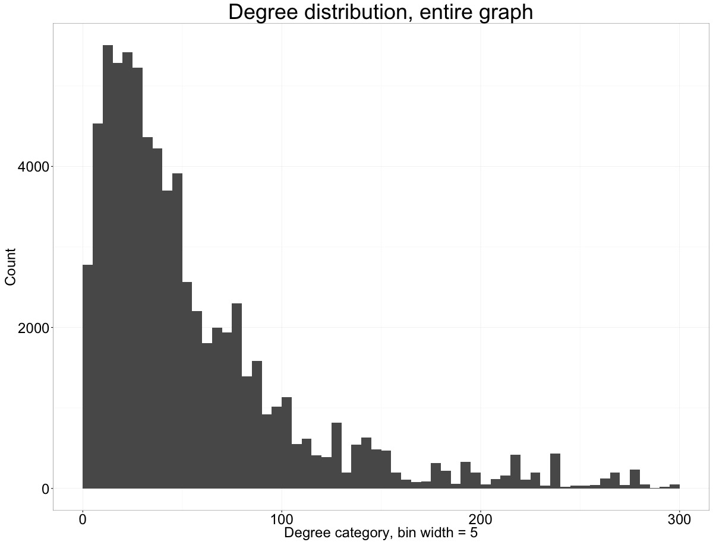
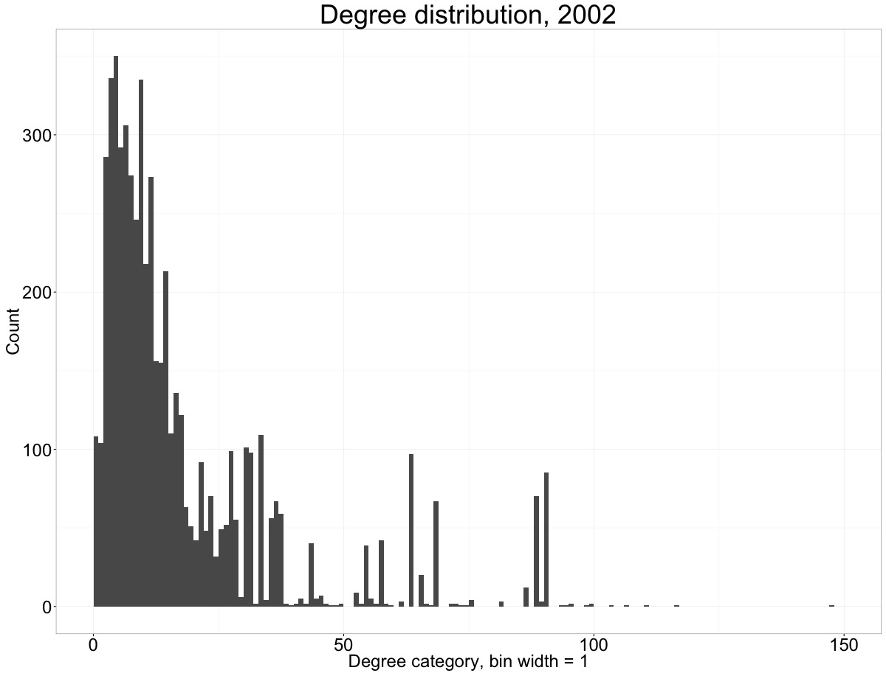
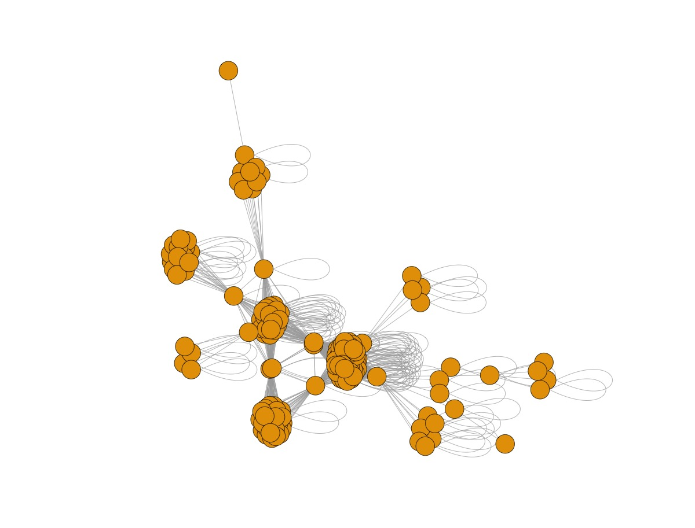

##Prelude

A long while ago I wrote an undergraduate thesis. Thanks to some phenomenal advising from several individuals it turned out to be a wonderful learning experience, and I often find myself thinking about the inherent question I asked in that project. I wanted to know how a large economic development agency such as the World Bank produces and dissimates the wealth of knowledge it has accumulated over time. It just so happened that in my analysis the proxie measure for this was indeed wealth - the cashflows from the Bank to its contractors and subcontractors that related one entity to another. I conceptualized these relationships as a network, a set of links between various organizations that have worked with the World Bank in Latin America.

In my limited, high-level analysis I concluded that this network hasn't exactly evolved over time. It remained largely static - the Bank kept on working with the same organizations who, in turn, retained their small clusters of partner firms. Thus, the knowledge, too, remained contained, a finding I found rather discouraging.

In the "Conclusions and further direction" section of my thesis I did bring up the possibility of a closer analysis of the participants of these networks, not just the individual node-firms but rather the communities they constituted and the relationships they held. This will be the ambition of this small project. The actual concrete goal here is to analyze the *entire* cashflow dataset (I didn't do this in my thesis) from very high above and, as a biproduct, produce a toolbox of code I can use to descend from meta, country views into node-to-node relationships in a meaningful way. Once I have that in place, studying individual firms and their behavior should be a matter of recycling my own code.


##Data

If there is one thing the World Bank has done right recently, in my mind it must be their data repository. In its strides towards transperency, the Bank started publishing much of its operational data, including its financials and contract info, all of which is available in a neat API and [report generator](http://databank.worldbank.org/data/home.aspx). We will be working with one specific database listed under [World Bank Group Finances](https://finances.worldbank.org/Procurement/Major-Contract-Awards/kdui-wcs3). These are all major contract awards starting from year 2000, including the associated dollar amount and contractor details. I downloaded the dataset (around 70mb and 205K+ rows) as a static cvs file.

##Plan of attack

We will start with some general descriptives and high level analyses of where the money is flowing from and where it's flowing to; then we'll move to something more interesting and detailed, specifically the communities and clusters of contractors and the stories they tell. I will present my findings first and include the annotated R code that produced it immediately below each section.

To start, we will load the packages that will be helping us.

```{r message=FALSE, warning=FALSE}
library(dplyr)
suppressPackageStartupMessages(library(googleVis))
library(ggplot2)
library(circlize)

#load the data
data <- read.csv('Major_Contract_Awards.csv', header=T, stringsAsFactors = TRUE)

#make sure all the columns are as we need them
data$Total.Contract.Amount..USD. <- as.numeric(data$Total.Contract.Amount..USD.)
data$Borrower.Country <- as.character(data$Borrower.Country)
data$Supplier.Country <- as.character(data$Supplier.Country)

#seems like the Bank (or whoever was inputing the data) doesn't know that Africa isn't a country :( We will manual remove such errors - the lists of countries should only include countries
#create a list of "strange" countries or miscoded regions for countries
exceptions.list <- c('3A', 'AC', '60', 'SR', '7B', 'GZ', '6C', '7C', '<NA>', '6R', '7E', '6L', '3S', '7X', '4E', '8S', '1W', '6A', '3E', '5M', '4P', '4A', '#', '3W')

country.data <- data %>% filter(!(Borrower.Country.Code %in% exceptions.list), !(Supplier.Country.Code %in% exceptions.list)) %>% group_by(Borrower.Country, Supplier.Country) %>% summarize(amount = sum(Total.Contract.Amount..USD.), contract.count = n())


```

##Money, big money

Over all the years of observation, the total contract cost was around $13,934,864,134. Almost 14 billion dollars wasn't necessarily spent/expensed but instead budgeted for all the contracts. Mean contract cost - just under $68,000, median - $68,033. Figure 1 shows the budget allocation over time; Figure 2 - the distribution by country.

```{r}
data %>% summarize(total.cost = sum(Total.Contract.Amount..USD.), avg.cost = mean(Total.Contract.Amount..USD.), median.cost = median(Total.Contract.Amount..USD.))
```


```{r results='asis'}
fy.cost <- data %>% group_by(Fiscal.Year) %>% summarise(total.cost = sum(Total.Contract.Amount..USD.))

fy.cost.graph <- gvisLineChart(fy.cost, 'Fiscal.Year', 'total.cost', options = list(hAxis="{title: 'Fiscal year', format:'Y'}", vAxis="{title: 'Total cost'}", series = "[{labelInLegend: 'Total cost'}]"))
print(fy.cost.graph, 'chart')
```
**Figure 1: total project cost, 2000-2015**


```{r}
#figure 2
borrower.country.sums <- country.data %>% group_by(Borrower.Country) %>% summarise(total.borrowed = sum(amount), contract.count = sum(contract.count))

debt.map <- gvisGeoChart(borrower.country.sums, locationvar = 'Borrower.Country', sizevar = 'contract.count', hovervar = 'Borrower.Country', colorvar = 'total.borrowed', options=list(colorAxis = "{values:[64875, 773540942], colors:['yellow', 'red']}", width=860, height=600))
```

```{r results='asis'}
print(debt.map, 'chart')
#note: I manually edited the html output to allow for thousands decimal point to show up in the tooltip (when hovering over any given country) since customizing the tooltip isn't natively available in gvis yet. Method described here: http://stackoverflow.com/questions/33771032/changing-the-number-format-in-google-charts-graphs-of-the-tooltip-data-and-also
```
**Figure 2: distribution of project cost by country, 2000-2015**


These general descriptive statistics should give us some sense of how large the Bank's operation is. In some countries (China, India), over 10,000 contract engagements are registered. The cost of these engagements exceeds $770 million in China and $732 million in India.

It may be worth clarifying what these numbers actually mean. The trail of dollars/contracts begins with the World Bank approving a project, typically an infrastructure investment (roads, schools, hospitals, etc.) or a service program (health education classes or natural park preservation initiative, for instance). By approving a project, the Bank issues capital to finance it. Depending on the complexity of the project at hand, the recipient/borrower country will require contractors or subcontractors to perform portions of the project. These "partners" may come from the borrower country itself or from abroad. We will explore these relationships next.

##Who works for whom?

Put yourself in the shoes of a loan recipient from the World Bank: you have the capital to do what you wanted to do, and now you need to figure out who will actually do the work. This choice should probably be a pragmatic, practical one. The work should be done by the person who will do it best and cheapest. This pragmatism doesn't always drive the decisions of project managers, however. There could be a firm with an established relationship with the borrower country, at home or abroad, a relationship built on reputation, loyalty, or, worse, graft. The country I grew up in seems to thrive on the latter to this day.

Without alleging any embezzlement in contractor relationships, let's examine some broader questions. For instance, for each borrower country, what portion of the contracts are performed by domestic firms versus foreign ones? One obvious limitation here: a firm might be registered in India, but it does not necessarily make it an Indian business. Unfortunately, this is as far as we can go with the public information available, so we'll have to settle here and beware of the bias.

```{r}
#We will recycle a data frame we created earlier - country.data

country.prop <- country.data %>% group_by(Borrower.Country, Supplier.Country) %>% summarise(dollar.sum = sum(amount), contract.sum = sum(contract.count)) %>% mutate(dollar.proportion = (dollar.sum/sum(dollar.sum) * 100), contract.proportion = (contract.sum/sum(contract.sum))*100) %>% filter(Borrower.Country == Supplier.Country)

proportions.map <- gvisGeoChart(country.prop, locationvar = 'Borrower.Country', colorvar = 'dollar.proportion', sizevar = 'contract.proportion', options=list(colorAxis = "{values:[0, 100], colors:['white', 'red']}", width=860, height=600))
```

```{r results='asis'}
print(proportions.map, 'chart')
```
**Figure 3: Reliance on contract services from the borrower country; darker color/higher percentage - more contract money is allocated to domestic contractors.**

By the looks of it, countries prefer keeping contracts and contract money at home. In some acute cases, such as Brazil or Argentina, some 90%+ of contract volume is reserved for domestic firms. Notice how that seems to hold true in Latin America in general. Part of this probably has to do with the types of projects that are happening in each region: Latin America, as I learned in my thesis work, seems to rely on smaller scale health, education, and governance efforts, as well as medium-size infrastructure projects. If you are going to build a school, chances are you'll buy your cement somewhere nearby.

Now look at Central Asia. In Turkmenistan, Kazakhstan, and Uzbekistan, there seem to be far more outsiders working on development projects compared to the average globally. Some countries in Central Africa, too, exhibit this same behavior. Take Algeria, for instance, where only 33% of contract work is awarded to domestic firms. I wonder if this has anything to do with the availability of the services demanded in those countries. I'd hate to generalize about the level of economic development in those places, but if there isn't a firm that knows how to lay internet cable around you'll probably have to go look elsewhere, potentially even abroad.

In general, I think it would be fair to conclude the most borrower countries are self sufficient and can mobilize the resources needed to complete the projects financed by the World Bank. To varying degree, they fill the knowledge or resource vacuum by contracting outsiders; we will look at this behavior next.

##Help from the outside

```{r eval = FALSE}
#create a chord diagram sample
#first, let's remove all the "self-supplying" we looked at above
country.data$type <- mapply(identical, country.data$Borrower.Country, country.data$Supplier.Country)
country.data <- country.data %>% filter(type == FALSE) %>% select(1:3) %>% ungroup() %>% arrange(desc(amount)) %>% top_n(25) %>% select(Supplier.Country, Borrower.Country, amount)

#now let's define the attributes of the chord graph - the colors of the links namely
col_fun <- colorRamp2(range(country.data$amount), c("#4281a4", "#fe938c"))

chord.diagram <- chordDiagram(country.data, col = col_fun, annotationTrack = "grid", preAllocateTracks=list(track.height = 0.3))
                              
circos.trackPlotRegion(track.index=1, panel.fun=function(x,y) {
  xlim = get.cell.meta.data("xlim") 
  ylim = get.cell.meta.data("ylim")
  sector.name=get.cell.meta.data("sector.index")
  circos.text(mean(xlim), ylim[1], sector.name,facing="clockwise",
              niceFacing=TRUE,adj=c(0,0.5))},bg.border=NA)
```


**Figure 4: Aggregate cash flows for international contracts, top 25 countries by dollars spent**

Apologies for not having an interactive chord diagram here - there are ways to accomplish it in R, but the interactive product isn't very stable in my experience, so we will have to settle on a static one.

Interactive or not, an interesting image emerges. The top provider of contractor services turns out to be France (the widest segment on the circumference of the chord diagram), and its partnerships are quite diversified. French companies work with multiple African countries, some of which are former French colonies. Another former colonial power, the UK, seems to work with a few African states. China is a curious case: some American firms are involved in development work there on World Bank's money and so are German companies. China, in turn, is helping out Vietnam (no surprise) and is trying to wedge itself into Indo-Bengladesh development partnerships. Is this a case of the Chinese exerting soft but valuable influence on regional level? Perhaps, but I wonder, too, if this behavior is more symbolic than pragmatic (read "profit seeking"). Chinese *state* contractors helping out with development of a neighbor of their most serious Asian contender is a nice reminder of their economic power and reach.

Frankly, I was expecting to see a much more one-side flow of services from the global North to the global South, from those who can provide "advanced" services and know-how to those who need these. The situation appears quite a bit more complicated and potentially illustrative of some geopolitical chess games beyond the scope of this work.

##Networks of cash

Next, let's examine the contracts as a collection of nodes and links between them - a network. If we convert the data in its current format into a social network, we will get series of subcommunities completely separated from each other; these communities will represent individual projects and firms involved in them. Therefore, it will be much more interesting to reconceptualize the network as groups of partnerships. *If two firms worked together on the same project, they will be linked*. We should then expect a vast collection of nodes, some clustered together compactly (projects requiring many contractors) and some - rather sparse.

```{r}
#assign random IDs to unique contractors
data <- data %>% mutate(supplier.ID = as.numeric(Supplier))

#select only the necessary column, project and supplier IDs
network.data <- data %>% select(6,21)
```

###A slightly more techinical aside

I will insert a bit of slightly more technical discussion here, since this portion of the project was by far the most challenging one to optimize and one I needed to get outsiders' help for. I reckon somebody trying to conduct a similar analysis (create an edge list for a social network out of a grouping variable and an ID of 200,000+ records) might find this helpful.

So our next logical step would be create the said [edge or adjacency list](https://en.wikipedia.org/wiki/Adjacency_list): two firms, A and B, have worked on the same project #1. Therefore A and B will be connected (A->B, where the link is **not directed**). We have over 205,000 contract records and some 70,000 unique contractors; therefore, we expect the number of links to be rather high, somewhere in the order of millions.

My first stab at this was a rather clumsy one: I tried breaking up all 205K rows into groups by Project ID that I then converted into a list (aggregate of data frames). This was accomplished by a base function called `split`. From there I computed every permutation of elements in a vector of supplier IDs. Annotated code of this is below:

```{r eval=FALSE}
try.list <- split(network.data, network.data$Project.ID) #split the data frame into a list of data frames by factors of Project.ID
try.output <- lapply(try.list, function(x) combn(x$supplier.ID, 2)) #plow through this list of some 6700 elements and calculate every permutation of supplier.ID pair within that group
```

The result of this clumsiness was a list object that weighted 130GB and took two hours to cycle through. Not optimal. A friend of mine even suggested going to Amazon's EC2 and running that calculation there. Before I did that, however, I turned to Stack Overflow and asked for advice there. Three 'competitive' methods came out of that:

1. simply merge two identical `network.data` data frames by project ID; then remove all instances where both supplier IDs in a pair are the same. This was an elegant solution I never really considered, but the computation took upwards of 8 minutes - much, much better than two hours but still too long in my mind

2. use one of the conversion functions of `igraph`, package we will soon be using, to transform our project groups into lists of node pairs. I didn't test this option, but, again, it seems neat and applicable

3. stick with `dplyr` and apply `combn` within groups created by `group_by`. I ran with this choice suggested by [Ven Yao](http://stackoverflow.com/users/3355724/ven-yao). I actually struggled to do something like this very early on in the process but could not for the life of me sort out why `combn` wouldn't run on dplyr-created groupings. It was this struggle that actually led me astray on that `split` venture.

```{r}
edge.list <- network.data %>% group_by(Project.ID) %>% filter(n()>=2) %>% group_by(Project.ID) %>% do(data.frame(t(combn(.$supplier.ID, 2)), stringsAsFactors = FALSE))
```

A few elements of this answer I couldn't figure out myself:

- filtering out only those groups where there were more than two suppliers. I don't think this would be crucial to do, but it sets up the data frame for what follows

- transposing the product of `combn` via `t`. Very sensible to do within this chained function, not after the enormously long (two rows by some millions of columns) comes back

- wrapping up all of this business in a `do` complement; I'm still not very comfortable with what this does, but it does seem like a neat application

Finally, in order to achieve the result I was hoping to see, some additional massaging is needed. The code for this is below, with annotations:

```{r}
#roll up repeating edges to be counted/summed in a third column
edge.list <- edge.list %>% group_by(X1, X2) %>% summarize(n = n())

#apply a sorting function which would sort each column in an ascending order
edge.sort <- t(apply(edge.list[,1:2], 1, sort))

#now remove rows that repeat, even if vertecies are reversed
edge.dupsremoved <- edge.list[!duplicated(edge.sort),]

#we will also have to remove instances where the supplier name is missing (ID = 1)
edge.dupsremoved <- edge.dupsremoved %>% filter(X1 != 1)
```


##Networks of cash, cont.

Back to some interesting stuff. We have a list of edges. Let's try and turn this into a social network.

When I was writing my thesis, I had a much less powerful laptop and far less experience with R, so this portion was actually performed in [Gephi](https://gephi.org/), an incredible free, open source tool for social network analysis. If not for Gephi, I would have slept far less and struggled far more. I'd like to stick to `igraph` here, though. It has grown and matured in the two years I didn't touch it, so I thought I'd give it a shot.


```{r message=FALSE, warning=FALSE, eval=FALSE}
library(igraph)

#Compute a simple network graph
first.net <- graph.data.frame(edge.dupsremoved, directed = FALSE)
```

I produced a simple, vanilla network graph here. The picture won't be terribly pretty and I won't include it here, but running `graph.data.frame` allows us to treat the output as a social network object and run some interesting tests on it.

Let's start with the descriptives.

```{r eval=FALSE}
length(V(first.net)) #figure out how many nodes there are (we know this already, but just to be complete)

length(E(first.net)) #same for edges

graph.density(first.net) #compute graph density - number of edges divided by the number of possible edges, expecting a very low figure

node.degree <- data.frame(degree(net.2002)) #compute degree/degree distribution of the graph, per node, then averaged below

mean(node.degree$degree.first.net.)

radius(first.net) #compute radius of the graph

edge.connectivity(first.net) #compute edge connectivity of the graph as a whole

betweenness(first.net, directed = FALSE) #compute generic betweenness centrality measure

closeness(first.net, vids = V(graph), weights = 'n') #compute closeness for all nodes in the graph and account for 'repeated interactions' modelled by the 'n' column
```

After a few minutes (the graph object is almost 83mb), R returned the results. The graph is composed of 74,004 nodes (firms) that are connected by 2,246,921 edges (interactions). The network is quite sparse, at .000821: for every 10,000 edges that are possible only 8.21 exist. Mean degree (the number of nodes an average node is connected to) is 60.72. This actually doesn't tell us too much - it would be far more useful to study the distribution of degree via a simple histogram.

```{r eval=FALSE}
degree.histo <- qplot(node.degree$degree.first.net., geom = 'histogram', binwidth = 5, xlim = c(0, 300), xlab = 'Degree category, bin width = 5', ylab = 'Count', main = 'Degree distribution, entire graph') + theme_bw()

plot(degree.histo)
```

**Figure 5: Histogram showing the frequency of degrees (connections) across all nodes. Bin width is 5.**

The graph is something I expected to see. It has a lengthy tail to the right, and substantial portion of nodes resides in the 0-100 range - these have between 0 and 100 connections in the network.

This is actually as far as I could go with `igraph`. All other functions took hours to run and I suspect it would have been running for days on end had I not stopped it. I did a bit of research, and turns out that `igraph` has serious trouble with moderately large data sets. I also overestimated how much more powerful my current machine is over the laptop I used in college. I thus turned to Gephi. 

But even this software has trouble manipulating a dataset this substantial. While it's common to sample the data and create smaller representations of this contractor universe, I don't want to compromise this very attribute of the data (we have a chance to study *all* contractors who have worked with the Bank *in the last 15 years*). I think doing equates to simplifying potential lessons and conclusions.

To do a more complete analysis, an analysis of the entire contractor ecosystem, a more powerful platform is needed, and I'm planning finishing this in the nearest future. For now, let's pick a few years and treat them as snapshots of the Bank's operation. I will rerun the code above but only leave the data from 2002, the year World Bank's spending was at its highest.

```{r message=FALSE, warning=FALSE}
#create an index of companies, to be used later
firms.2002 <- data %>% filter(Fiscal.Year == '2002') %>% distinct(supplier.ID) %>% select(supplier.ID, Supplier, Supplier.Country)

network.data <- data %>% filter(Fiscal.Year == '2002') %>% select(6,21)

edge.list.2002 <- network.data %>% group_by(Project.ID) %>% filter(n()>=2) %>% group_by(Project.ID) %>% do(data.frame(t(combn(.$supplier.ID, 2)), stringsAsFactors = FALSE))

edge.list.2002 <- edge.list.2002 %>% group_by(X1, X2) %>% summarize(n = n())

edge.sort.2002 <- t(apply(edge.list.2002[,1:2], 1, sort))

edge.dupsremoved.2002 <- edge.list.2002[!duplicated(edge.sort.2002),]

edge.dupsremoved.2002 <- edge.dupsremoved.2002 %>% filter(X1 != 1)
```

Now let's run the descriptives for this subset:

```{r echo=FALSE, results='hide', message=FALSE}
library(igraph)
```

```{r}
colnames(edge.dupsremoved.2002) <- c('from', 'to', 'weight')

net.2002 <- graph.data.frame(edge.dupsremoved.2002, directed = FALSE, vertices = firms.2002)
#already looks promising - the data weight only 2.1mb

length(V(net.2002))
length(E(net.2002)) 
graph.density(net.2002)
node.degree <- data.frame(degree(net.2002)) 
mean(node.degree$degree.net.2002.)
edge.connectivity(net.2002)
```

Here are the basic descrriptive statistics for the graph. There are 5,733 nodes and 50,989 vertices. The density for this graph is .0031 (for every 1,000 possible connections 3.1 actually exist), which is more dense than the "mothership" social network. This is expected - a subset of the entire network should probably be a tighter community. However, the average number of degrees per node is around 17.8, much less than above. We will create a histogram of this metrics below.

```{r message=FALSE, warning=FALSE, eval=FALSE}
degree.histo.2002 <- qplot(node.degree$degree.net.2002., geom = 'histogram', binwidth = 1, xlim = c(0, 150), xlab = 'Degree category, bin width = 1', ylab = 'Count', main = 'Degree distribution, 2002') + theme_bw() + theme(plot.title = element_text(size = rel(3)), axis.text=element_text(size = rel(2)), axis.title=element_text(size = rel(2)))

plot(degree.histo.2002)
```


This graph looks somewhat similar to the one above; vast majority of nodes reside on the left side (have relatively low degree count). There is no extended right tail here, although some odd node does seem to have around 150 connections.

##Cliques, groups, and communities

Now some really interesting stuff. Our nodes (firms) are inherently and explicitly related - they have worked on the same project. However, there might be some other inherent relationship between them, an attribute that connects them into informal groups. I will try and identify these groups next.

First, we'll try to identify communities via greedy optimization of modularity. [The official documentation](http://igraph.org/c/doc/igraph-Community.html#idm470933305280) offers an excellent summary of these methods and concepts; this methodology is somewhat new to me, as my original thesis work only barely touched the concept of communities.

```{r message=FALSE, warning=FALSE}

fg.2002 <- fastgreedy.community(net.2002)
length(fg.2002)

```

This function returns an object of a very sensibly named class called "communities". In a nutshell, it is a label assigned to each node according to the classification produced by our detection function, here `fastgreedy.community`. Fast and greedy community detection seems to be the simplest detection function available in igraph; it begins by assuming that each node is its own little community and builds out the communities across the adjacent nodes while optimizing modularity (the measure of how "separate" or distinct these created communities are). Behind the scenes the product looks like a decision tree or a dendrogram, though we can apply the attribute created here to color our overall network and thus explicitly show all the different communities the function has identified.

In our case, the first detection function identified 792 communities, which seems like quite a few. Let's examine these communities a bit closer. What's the largest community created?

```{r eval=FALSE}
which.max(sizes(fg.2002))
sizes(fg.2002)
```

Community #1 happens to be the largest, with 753 members. That's massive and probably simply an overfitted crowd of firms that happen to be somehow linked to each other. We'll select this giant group and explore it a bit further.

```{r message=FALSE, warning=FALSE}
#now let's select the firms that belong to this community - really their supplier IDs
firms.comm1 <- V(net.2002) [membership(fg.2002)==1] %>% .$name %>% data.frame()
subntw.comm1 <- subgraph(net.2002, V(net.2002) [membership(fg.2002)==1])
```

It appears as though my suspicions were correct. This community seems to be the product of overfitting, a common side effct of applying `fastgreedy.community`. The function seems to generalize and pull in nodes that happen to conform to its optimization standards. Looking at the list of nodes here, I see large multinational consulting firms (Deloitte and KPMG, for instance) and smaller, regional companies. Most are not as well integrated into the network:

```{r}
mean(degree(subntw.comm1))
```

Let's look at another community, #2.

```{r message=FALSE, warning=FALSE}
firms.comm2 <- V(net.2002) [membership(fg.2002)==2] %>% .$name %>% data.frame()
subntw.comm2 <- subgraph(net.2002, V(net.2002) [membership(fg.2002)==2])
mean(degree(subntw.comm2))
graph.density(subntw.comm2)
```

This subcommunity is rather tightly knit. The mean degree count is over 32 and graph density - .2074, both well above the overall statistics for the 2002 network, which warrants a more qualitative exploration.

```{r eval=FALSE}
l <- layout.fruchterman.reingold(subntw.comm2)
plot(subntw.comm2, layout=l, vertex.size = 10, vertex.label = NA)
```

**Figure 6: Graphical representation of community #2, no labels intentionally**

```{r message=FALSE, warning=FALSE}
which.max(degree(subntw.comm2))
```

There are several clusters of nodes here, all most likely related by their country of origin/operation. Out of 156 firms represented here, 104 are Indian, overwhelmingly operating in India on substantial infrastructure projects. These firms work together repeatedly and quite often partner with outsiders for procurement and consulting needs. It seems as though this network was identified as a subcommunity for two reasons: one, the cohesion between India-based firms who work in energy and mining (the most "connected" node is India-registered energy multinational called ABB), and two, other multinationals who act as transit nodes between communities. For instance, a German consultancy called Lahmeyer International GMBH is firmly embedded into the overall World Bank ecosystem and manages infrequent but far-reaching projects around the globe, from Moldova to Nepal to El Salvador.

##Conclusions from n of 1

This is the spirit I will proceed in in my analysis, but to limit the length of this particular post, I'll end it here. Lessons learned:

- data massaging is extremely time consuming but obviously is necessary and well worth the exercise; I now have a clean meta dataset I can explore further
- my MacBook Pro isn't as beastly as I thought it might be; I need to look into some distributed computing options or services like Amazon's EC2 to analyze the entire dataset of cashflows
- though often aritificial (I explored several other, smaller communities in the year of 2002), the clusters/cliques igraph has identified highlight the importance of nodes located in between communities. These connector nodes pull smaller subgroups together and construct the image we saw above
- partnerships, out of repeated interaction, trust, reputation, or dependency (let's leave it at this vague term) mattered in 2002, and I'd like to test this observation for other years as well.

To be continued.

####[Complete code, with comments](https://github.com/snakonechny/contractor-ties/blob/master/contractor-ties-script.R)